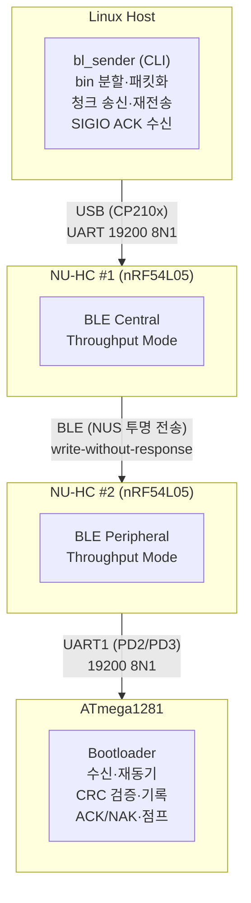
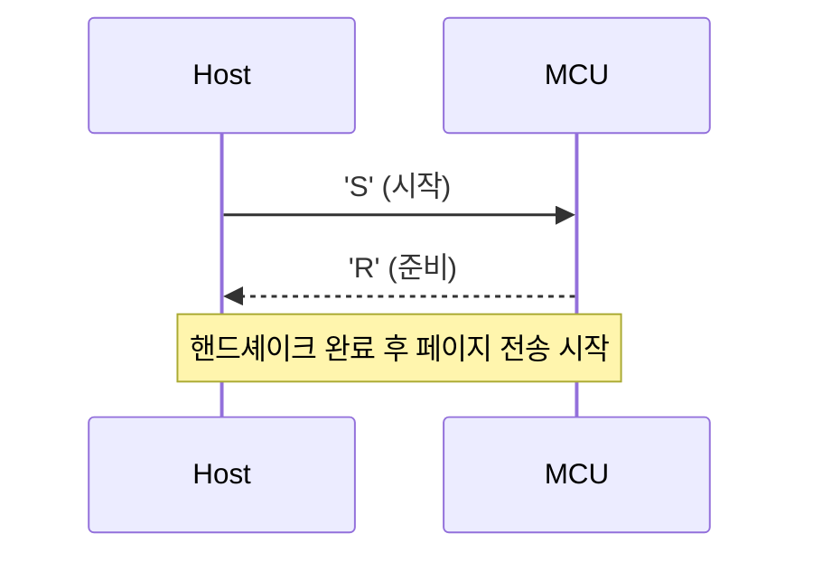
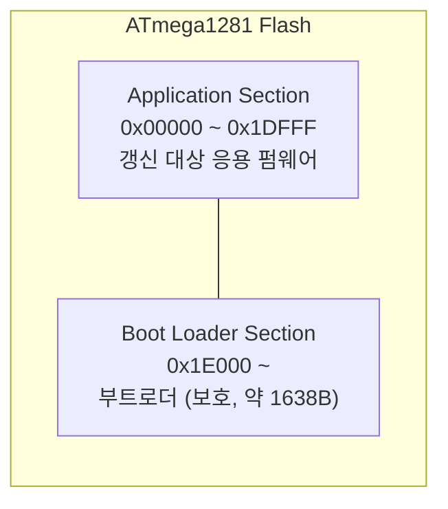
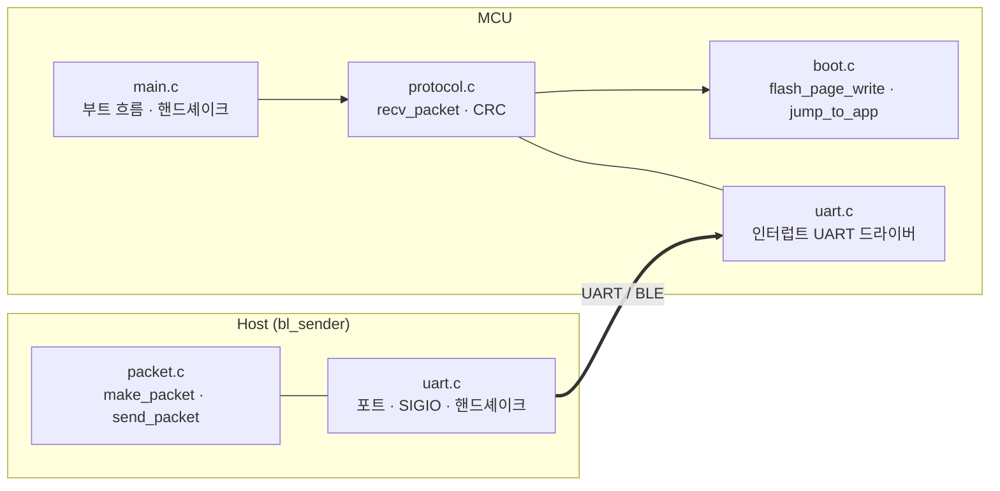

# 시스템 아키텍처 및 기능분할

- 프로젝트: NU-HC UART-BLE 부트로더
- 문서 버전: v0.1.0
- 기준일: 2026-06-18
- 작성자: 이한서

## 1. 논리 아키텍처

## 2. 호스트(bl_sender) 책임

| 기능 | 설명 |
| --- | --- |
| Binary Loader | bin 파일 적재, 256바이트 페이지 수 산출 |
| Packet Builder | 262바이트 패킷 구성, CRC16 계산 |
| Port Manager | termios raw 설정(19200/8N1), SIGIO 비동기 수신 |
| Handshaker | `'S'` 송신, `'R'` 응답 대기 |
| Chunk Sender | 20바이트 분할 송신, NU-HC flush 정렬 |
| Ack Handler | SIGIO로 ACK/NAK/READY 분류 |
| Retry Manager | NAK/타임아웃 시 재전송(MAX_RETRY=3) |

## 3. NU-HC 모듈 책임

| 기능 | 설명 |
| --- | --- |
| BLE Link | Central(#1)–Peripheral(#2) 자동 연결 유지 |
| Transparent Transfer | Throughput Mode로 UART↔BLE 무변형 전달 |
| Flush 정책 | 182바이트 또는 16 ms 간격 flush |
| Mode 관리 | 데이터 구간 Throughput, 설정 구간 Command(`+++` escape) |

NU-HC 모듈은 데이터 내용을 해석하지 않으며, 신뢰성·정렬·검증은 호스트와 MCU가 책임진다.

## 4. MCU 부트로더 책임

| 기능 | 설명 |
| --- | --- |
| Vector Relocation | IVSEL로 인터럽트 벡터를 부트 영역으로 재배치 |
| Boot Wait | 부트 진입 후 `'S'` 시작 신호 대기 |
| Handshake | `'S'` 수신 시 RX 큐 비우고 `'R'` 응답 |
| Packet Receiver | START_CODE 재동기 후 262바이트 수신 |
| Integrity Check | CRC16 재계산·비교 |
| Flash Writer | 응용 영역 페이지 기록, 부트 영역 보호 |
| Responder | ACK/NAK를 UART1로 전송 |
| App Jumper | MSG_END 시 응용 진입 |

## 5. UART 드라이버 계층

| 채널 | 핀 | 용도 | 구조 |
| --- | --- | --- | --- |
| UART0 | PE0/PE1 | 디버그 출력 | 인터럽트 + 256B 원형큐 |
| UART1 | PD2/PD3 | NU-HC 데이터 | 인터럽트 + 256B 원형큐 |

RX는 `RX_vect`가 항상 수신, TX는 `UDRE_vect`가 큐 송신 후 빌 때 인터럽트 비활성화한다. 인덱스는 `uint8_t`로 AVR에서 원자적 접근을 보장한다.

## 6. Data Plane

## 7. Control Plane

| 방향 | 메시지 |
| --- | --- |
| Host → MCU | 'S'(시작), DATA 패킷, END 패킷 |
| MCU → Host | 'R'(준비), ACK, NAK |
| NU-HC 내부 | AT 명령(LECCONN, TPMODE), `+++` escape |

## 8. 메모리 맵

| 영역 | 주소 | 용도 |
| --- | --- | --- |
| Application | 0x00000 ~ 0x1DFFF | 갱신 대상 응용 펌웨어 |
| Bootloader | 0x1E000 ~ | 부트로더 코드(보호 영역, 약 1638 byte) |

페이지 기록 주소가 0x1E000(BOOT_START) 이상이면 거부하여 부트로더 자기 파괴를 방지한다.

## 9. 타이밍 기준

고정 지연 대신 이벤트 기반 동기화를 우선한다.

1. 패킷 시작: START_CODE(0xEF) 도착 시점 (재동기)
2. 송신 완료: TX 큐 비움 + TXC 플래그 (`USART1_FlushTx`)
3. 응답 대기: ACK 수신 즉시 진행, 미수신 시 타임아웃

## 10. 구현 단위

| 구현 단위 | 위치 |
| --- | --- |
| 패킷 생성/CRC | Host `packet.c` |
| 청크 송신/재전송 | Host `packet.c` `send_packet` |
| 포트/SIGIO/핸드셰이크 | Host `uart.c` |
| 수신/재동기/검증 | MCU `protocol.c` `recv_packet` |
| 페이지 기록/점프 | MCU `boot.c` |
| 인터럽트 UART 드라이버 | MCU `uart.c` |
| 부트 흐름/핸드셰이크 | MCU `main.c` |

## 11. 향후 확장(장기 목표)

| 항목 | 내용 |
| --- | --- |
| 보안 | AES-256-CCM 암호화 + SHA-256 무결성(nRF54L05 CRACEN) |
| 자동 리셋 | 인밴드 RESET 명령 + NU-HC GPIO 또는 워치독 소프트 리셋 |
| 플랫폼 이식 | nRF54L05 자체 Secure DFU 부트로더로 포팅(Zephyr/NCS) |
| 프레이밍 | SOF/EOF 양끝 + 프레임 타임아웃 도입 |
