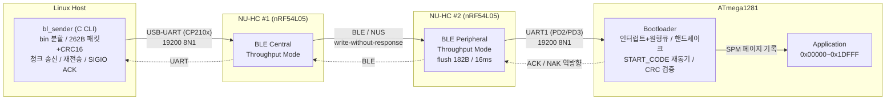
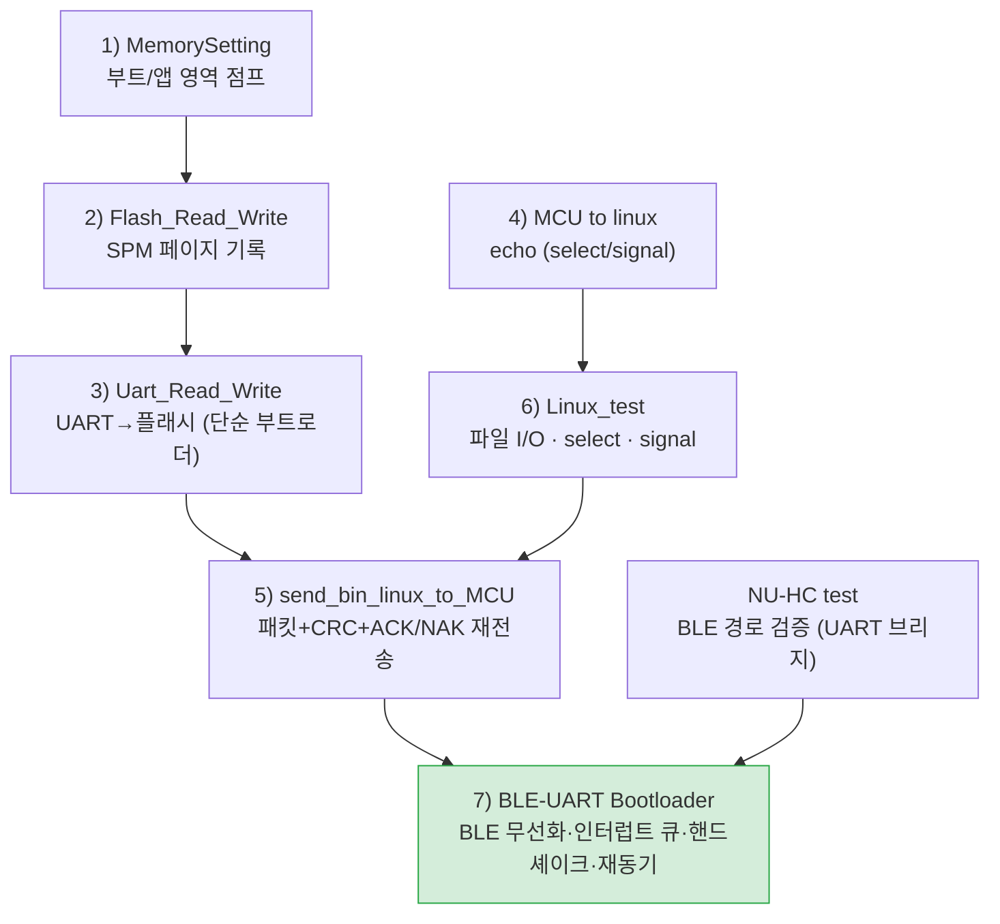
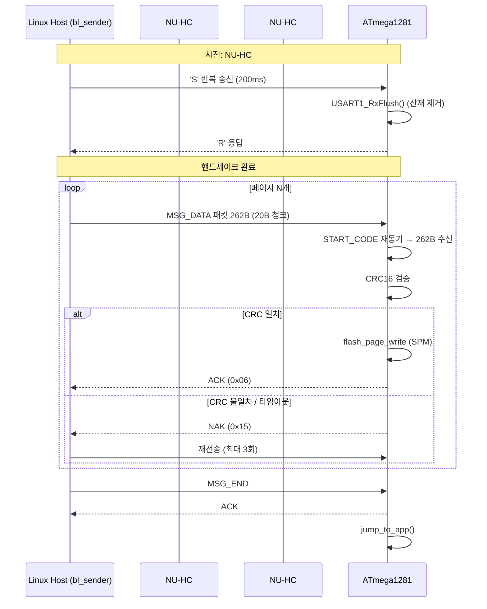
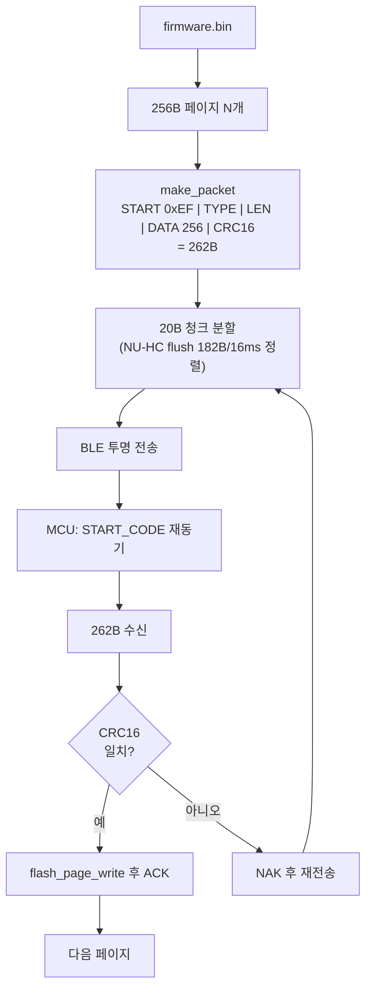
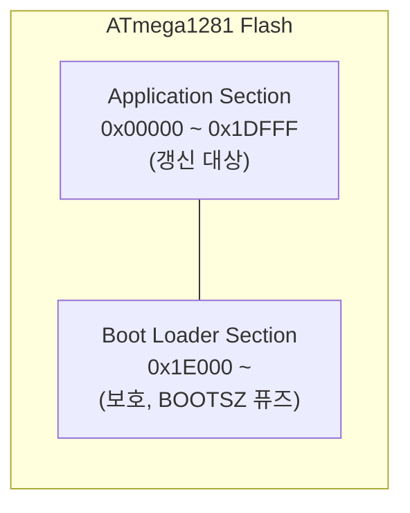

# BLE-UART Bootloader

ATmega1281용 부트로더를 **메모리 기초부터 BLE 무선 펌웨어 갱신까지** 단계적으로 구축한 프로젝트 모음이다. 각 단계는 이전 단계의 결과물을 재료로 삼아, 최종적으로 하드웨어 디버거(J-Link) 없이 BLE를 통해 응용 펌웨어를 무선으로 갱신하는 부트로더를 완성한다.

> 환경: ATmega1281 (16 MHz, 5 V) · Microchip Studio (AVR) · Ubuntu(VMware) · CP210x USB-UART · NU-HC(nRF54L05) ×2

---

## 목차

1. [전체 아키텍처](#1-전체-아키텍처)
2. [개발 단계와 폴더 구성](#2-개발-단계와-폴더-구성)
3. [업로드 시퀀스](#3-업로드-시퀀스)
4. [데이터 흐름](#4-데이터-흐름)
5. [메모리 맵](#5-메모리-맵)
6. [프로토콜 진화](#6-프로토콜-진화)
7. [핵심 사양](#7-핵심-사양)
8. [문서](#8-문서)
9. [향후 목표](#9-향후-목표)

---

## 1. 전체 아키텍처

최종 시스템(프로젝트 7)은 호스트 → BLE 브리지 → 대상 MCU의 3계층으로 구성된다.

설계 원칙: **호스트가 분할·재전송을 책임지고, NU-HC는 내용을 해석하지 않고 투명 전송하며, MCU가 정렬·검증·기록을 책임진다.**

---

## 2. 개발 단계와 폴더 구성

각 단계가 무엇을 추가하는지가 핵심이다.

| # | 폴더 | 추가되는 것 | 결과물 |
| --- | --- | --- | --- |
| 1 | `1) Bootloader_MemorySetting` | 부트/앱 영역 개념, 영역 간 점프 | `jmp 0x0` 점프 검증 |
| 2 | `2) Flash_Read_Write` | SPM 플래시 기록 | `flash_page_write` (erase→fill→write) |
| 3 | `3) Uart_Read_Write` | UART 수신 → 플래시 | 단순 UART 부트로더 (9600, 폴링) |
| 4 | `4) MCU to linux` | 호스트 연동, 통신 방식 | echo (select / signal) ※README 보유 |
| 5 | `5) send_bin_linux_to_MCU` | 패킷·CRC·ACK/NAK·재전송 | UART 부트로더 (19200, `bl_sender`) |
| 6 | `6) Linux_test` | 호스트 빌딩블록 | 파일 I/O, select, signal 참조 코드 |
| 7 | `7) BLE-UART Bootloader` | BLE 무선화, 인터럽트 큐, 핸드셰이크, 재동기 | 최종 BLE 부트로더 |
| - | `NU-HC test` | BLE 경로 검증 | UART0↔UART1 브리지 |
| - | `00.docs` | 설계 문서 | 요구사항·기능·아키텍처·프로토콜·인터페이스·설계·트러블슈팅 |

---

## 3. 업로드 시퀀스

핸드셰이크부터 응용 점프까지의 전체 흐름이다.

---

## 4. 데이터 흐름

응답(ACK/NAK)은 `MCU → NU-HC#2 → BLE → NU-HC#1 → Host`로 역방향 전달되어, 호스트의 SIGIO 핸들러가 비동기 수신한다.

---

## 5. 메모리 맵

| 항목 | 값 |
| --- | --- |
| 페이지 크기 | 256 byte (128 word) |
| 부트로더 코드 | 약 1638 byte (.text) |
| 부트로더 RAM | 약 1032 byte (.bss, RX/TX 원형큐 4×256 포함) |
| 영역 보호 | `write_addr >= 0x1E000` 기록 거부 → 부트로더 자기 파괴 방지 |

---

## 6. 프로토콜 진화

단계별로 신뢰성·구조가 어떻게 강화됐는지 보여준다.

| 항목 | 3) Uart_Read_Write | 5) send_bin | 7) BLE-UART |
| --- | --- | --- | --- |
| 보레이트 | 9600 (UBRR=103) | 19200 (UBRR=51) | 19200 (UBRR=51) |
| 패킷 | 256B raw 페이지 | 262B (헤더+CRC) | 262B (헤더+CRC) |
| 종료 신호 | 0xFF | MSG_END(0x02) | MSG_END(0x02) |
| 무결성 | 없음 | CRC16 | CRC16 |
| 응답 | ACK만 | ACK/NAK | ACK/NAK + 재전송 |
| UART | 폴링, 단일 | 폴링, 단일 | 인터럽트+큐, 이중 |
| 핸드셰이크 | READY 문자열 | (없음) | 'S'/'R' |
| 정렬 복구 | 없음 | START 1회 확인 | START_CODE 재동기 |
| 전송 매체 | UART 직결 | UART 직결 | BLE (NU-HC) |

---

## 7. 핵심 사양

| 항목 | 값 |
| --- | --- |
| MCU | ATmega1281, 16 MHz, 5 V |
| UART | 19200 bps, 8N1 (`UBRR=51`, 오차 0.2%) |
| 패킷 | 262B = START(0xEF)+TYPE(1)+LEN(2,LE)+DATA(256)+CRC16(2,LE) |
| 메시지 | MSG_DATA(0x01), MSG_END(0x02), ACK(0x06), NAK(0x15) |
| CRC | CRC-16/CCITT-FALSE (poly 0x1021, init 0xFFFF), 범위 TYPE+LEN+DATA |
| BLE | NU-HC ×2, Nordic UART Service, Throughput Mode |
| 도구 | Microchip Studio (AVR), gcc (Linux) |

> 16 MHz에서 115200은 약 +2.1% 오차로 262B 스트림이 깨져, 오차 0.2%인 19200을 사용한다.

---

## 8. 문서

상세 명세는 `00.docs` 폴더 참고:

| 문서 | 내용 |
| --- | --- |
| 01 요구사항 명세서 | 사용자·시스템 요구사항 |
| 02 기능 명세서 | 호스트·MCU 기능 |
| 03 시스템 아키텍처 | 계층 구조·책임 분할 |
| 06 프로토콜 명세서 | 패킷·핸드셰이크·CRC |
| 07 인터페이스 정의서 | 핀·레지스터·AT 명령 |
| 08 상세 설계 명세서 | 함수 단위 동작 |
| 09 설계근거 및 트러블슈팅 | 설계 결정·디버깅 |

---

## 9. 향후 목표

BLE 모듈(nRF54L05) 자체에 **보안 DFU 부트로더**를 포팅한다. AES-256-CCM 암호화 + SHA-256 무결성 검증(CRACEN 하드웨어), APPROTECT 디버그 보호, SOF/EOF 프레이밍을 적용하여 모듈 펌웨어를 안전하게 무선 갱신하는 것을 목표로 한다.
